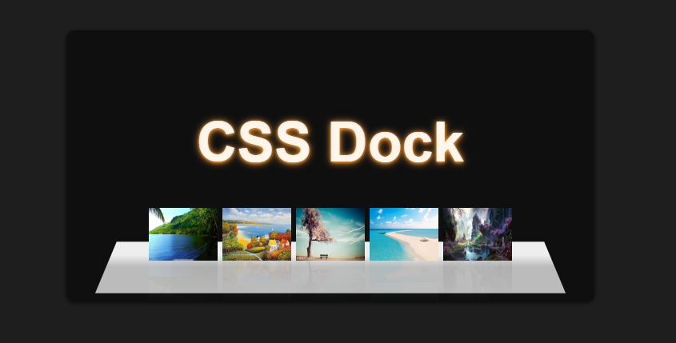

<h3>目标</h3>:
借助CSS3的新特性来模拟iOS系统桌面的Dock导航效果。

<h3>效果</h3>:
<ul>
<li>
导航项目水平排列居中显示，并且具有翻转的倒影效果（box-reflact）;
</li>
<li>
导航项被点击后，会有一个上下弹跳，并且底部有一个高亮圆点显示，表示当前导航已被点击（貌似很难看见）；
</li>
<li>
用户鼠标悬浮在导航项上的时候，会有一个tips的提示效果，同时导航项图片具有放大效果；
</li>
<li>
让所有的导航项放置在一个面板上。
</li>
</ul>

